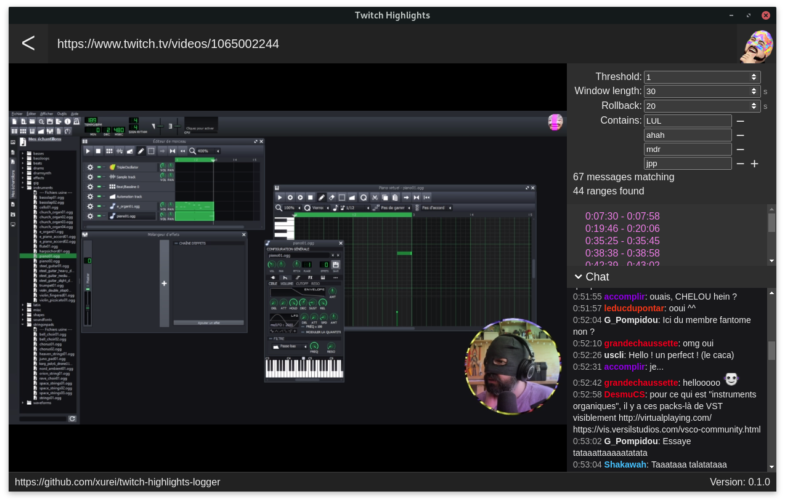

    
    <h1>Twitch Highlights</h1>
    <h3>Find interesting moments on a Twitch VOD</h3>

 

    
    
    

    
    

## Installation
Install from the [Releases page](https://github.com/xurei/twitch-highlights-logger/releases).

## How it works
The app loads the full chat log from twitch.tv and counts the number of messages in a given window of time.
When the number of messages matching a certain filter reach a threshold, the app considers it as an highlight.
You can select the highlight in the UI and the video will jump to this moment.

   

## Special mentions
This app has been originally created for [Copain du Web](https://www.twitch.tv/copainduweb/).

## Support Open-Source ♥
Support my work on https://github.com/sponsors/xurei
